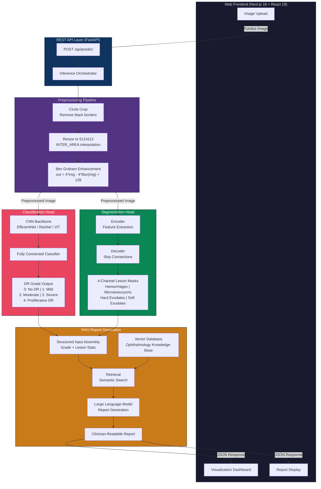
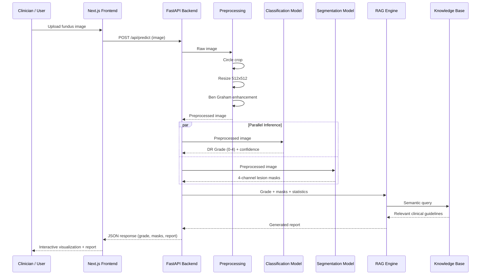

<p align="center">
  
  
  
  
  
</p>

# RetinaInsight

**AI-powered Diabetic Retinopathy diagnosis system combining deep learning classification, lesion segmentation, and RAG-based medical report generation.**

RetinaInsight analyzes retinal fundus images to simultaneously determine disease severity (5-class DR grading) and localize pathological lesions (hemorrhages, microaneurysms, hard exudates, and soft exudates), then synthesizes findings into clinician-readable reports through a Retrieval-Augmented Generation (RAG) pipeline. The system is designed as a clinical decision-support tool that augments — not replaces — ophthalmologist judgment.

---

## Table of Contents

- [Architecture Overview](#architecture-overview)
- [System Architecture Diagram](#system-architecture-diagram)
- [Technology Stack](#technology-stack)
- [Model 1 — Disease Classification](#model-1--disease-classification)
- [Model 2 — Lesion Segmentation](#model-2--lesion-segmentation)
- [RAG Report Generation](#rag-report-generation)
- [End-to-End Data Flow](#end-to-end-data-flow)
- [Dataset](#dataset)
- [EDA Findings and Data Challenges](#eda-findings-and-data-challenges)
- [Preprocessing Pipeline](#preprocessing-pipeline)
- [Image Quality Metrics](#image-quality-metrics)
- [Project Structure](#project-structure)
- [Getting Started](#getting-started)
- [API Reference](#api-reference)
- [Roadmap](#roadmap)
- [License](#license)

---

## Architecture Overview

RetinaInsight is built around a **dual-head inference pipeline**. A single retinal fundus image is processed through two independent deep learning models in parallel:

1. **Classification Head** — Determines the overall severity of diabetic retinopathy on the International Clinical DR Severity Scale (Grades 0 through 4).
2. **Segmentation Head** — Produces pixel-level masks identifying four types of pathological lesions present in the image.

The outputs from both models are then fused and passed into a Retrieval-Augmented Generation (RAG) engine that queries an ophthalmology knowledge base and generates a structured, natural-language medical report suitable for clinical review.

| Component | Purpose | Architecture | Status |
|---|---|---|---|
| **Classification Head** | Grade DR severity (0–4) | CNN (EfficientNet / ResNet) or Vision Transformer | In progress |
| **Segmentation Head** | Pixel-level lesion masks | U-Net or SegFormer encoder-decoder | Planned |
| **RAG Engine** | Generate medical reports from predictions | LLM + vector retrieval over ophthalmology literature | Planned |
| **Web Frontend** | Upload, visualize, and interact with results | Next.js 16 + React 19 | Scaffolded |
| **REST API** | Serve model predictions to the frontend | FastAPI / Flask (Python) | Planned |

---

## System Architecture Diagram

The following diagram illustrates the complete data flow from image upload through inference to report generation:



---

## Technology Stack

### Frontend

| Technology | Version | Role |
|---|---|---|
| **Next.js** | 16.3.4 | React framework with App Router, server components, and API routes |
| **React** | 19.2.8 | UI component library |
| **TypeScript** | 5.x | Type-safe JavaScript |
| **Tailwind CSS** | 4.x | Utility-first CSS framework |

### Backend (ML)

| Technology | Version | Role |
|---|---|---|
| **Python** | 3.10+ | Core language for data processing and model training |
| **PyTorch** | Latest | Deep learning framework for model development |
| **OpenCV** | Latest | Image preprocessing (circle crop, Ben Graham, CLAHE) |
| **NumPy** | Latest | Numerical computing and array operations |
| **pandas** | Latest | Dataset management and metadata handling |
| **FastAPI** | Planned | REST API to serve model inference endpoints |

### Infrastructure (Planned)

| Technology | Role |
|---|---|
| **FAISS / ChromaDB** | Vector database for RAG retrieval |
| **LangChain** | RAG orchestration framework |
| **Docker** | Containerized deployment |
| **CUDA** | GPU acceleration for training and inference |

---

## Model 1 — Disease Classification

> **Goal: "What disease severity does this eye have?"**

A convolutional neural network or Vision Transformer trained to classify retinal fundus images into one of **5 DR severity grades** according to the International Clinical Diabetic Retinopathy Disease Severity Scale.

### Clinical Grading Scale

| Grade | Label | Clinical Definition | Key Features |
|:---:|---|---|---|
| 0 | **No DR** | Healthy retina with no signs of diabetic retinopathy | No microaneurysms, hemorrhages, or exudates |
| 1 | **Mild NPDR** | Earliest detectable stage of non-proliferative DR | Microaneurysms only |
| 2 | **Moderate NPDR** | Intermediate stage between mild and severe NPDR | More than just microaneurysms; dot-blot hemorrhages, hard exudates, cotton-wool spots may be present |
| 3 | **Severe NPDR** | Advanced non-proliferative stage with high risk of progression | Extensive intraretinal hemorrhages in all 4 quadrants, venous beading in 2+ quadrants, IRMA in 1+ quadrant (4-2-1 rule) |
| 4 | **Proliferative DR** | Most advanced and sight-threatening stage | Neovascularization of the disc or elsewhere, vitreous or preretinal hemorrhage, tractional retinal detachment |

### Classification Pipeline

The classification pipeline applies a three-stage preprocessing sequence before feeding the image into the neural network. Each stage addresses a specific data quality issue identified during exploratory data analysis:

```
Raw Fundus Image
      |
      v
+---------------------+
| Circle Crop         |  Remove black borders and isolate the retinal disc.
|                     |  Without this step, the model may learn border size
|                     |  as a proxy feature (see EDA findings).
+----------+----------+
           |
           v
+---------------------+
| Resize to 512x512   |  Standardize input dimensions using INTER_AREA
|                     |  interpolation (optimal for downscaling).
+----------+----------+
           |
           v
+---------------------+
| Ben Graham           |  Subtract local average color to normalize
| Enhancement          |  illumination across the dataset.
|                     |  Formula: out = 4 * img - 4 * blur(img) + 128
|                     |  sigma = 10 (from original Kaggle implementation)
+----------+----------+
           |
           v
+---------------------+
| CNN / ViT Backbone   |  Feature extraction followed by fully connected
|                     |  classification into 5 severity grades.
+----------+----------+
           |
           v
     DR Grade (0-4)
```

### Model Architecture Candidates

| Architecture | Parameters | Rationale |
|---|---|---|
| **EfficientNet-B4** | ~19M | Strong accuracy-to-compute ratio; proven on medical imaging tasks |
| **ResNet-50** | ~25M | Well-understood baseline; extensive transfer learning support |
| **Vision Transformer (ViT-B/16)** | ~86M | Captures global context across the full retinal image; better at long-range dependencies |

### Target Metrics

| Metric | Target | Rationale |
|---|:---:|---|
| Quadratic Weighted Kappa | >= 0.85 | Primary metric for ordinal classification; penalizes predictions far from the true label more heavily |
| Macro F1 Score | >= 0.70 | Accounts for class imbalance by weighting each class equally |
| Sensitivity (Grade 3-4) | >= 0.90 | Clinical safety: must not miss sight-threatening DR cases that require urgent referral |
| Specificity (Grade 0) | >= 0.95 | Clinical efficiency: avoid unnecessary referrals for healthy patients |

### Training Strategy

- **Loss Function**: Ordinal cross-entropy or weighted cross-entropy with class weights inversely proportional to class frequency
- **Augmentation**: Random horizontal/vertical flip, rotation (up to 360 degrees), color jitter, random erasing, mixup/cutmix
- **Oversampling**: SMOTE-like oversampling of minority classes (Severe, Mild, Proliferative DR) to address the 6.96:1 imbalance ratio
- **Optimizer**: AdamW with cosine annealing learning rate schedule
- **Regularization**: Label smoothing (0.1), dropout, early stopping on validation kappa

---

## Model 2 — Lesion Segmentation

> **Goal: "Where exactly is the disease located?"**

A U-Net or SegFormer model that produces **pixel-level segmentation masks** for four pathological lesion types. This provides spatial localization that complements the classification model's severity grading, enabling clinicians to see precisely where lesions appear in the retina.

### Lesion Types

| Lesion Type | Mask Color | Clinical Significance | Typical Appearance |
|---|:---:|---|---|
| **Hemorrhages** | Black | Ruptured retinal blood vessels; indicator of moderate-to-severe DR | Dark red/brown spots, can be dot-blot or flame-shaped |
| **Microaneurysms** | Red | Earliest clinical sign of DR; tiny outpouchings of capillary walls | Very small (20-200 microns), round, dark red dots |
| **Hard Exudates** | Yellow | Lipid and protein deposits from vascular leakage; risk to macula if near fovea | Bright yellow/white deposits with well-defined borders |
| **Soft Exudates** | Green | Cotton-wool spots indicating retinal nerve fiber layer ischemia | Fluffy, white, poorly defined borders |

### Segmentation Pipeline

```
Raw Fundus Image
      |
      v
+------------------------+
| Preprocessing          |  CLAHE (Contrast Limited Adaptive Histogram
|                        |  Equalization) to enhance local contrast,
|                        |  followed by normalization.
+-----------+------------+
            |
            v
+------------------------+
| U-Net / SegFormer      |  Encoder-decoder architecture with skip
|                        |  connections. Encoder extracts hierarchical
|                        |  features; decoder recovers spatial resolution.
+-----------+------------+
            |
            v
+------------------------+
| Multi-class Mask       |  4-channel output where each channel is a
|                        |  binary mask for one lesion type. Sigmoid
|                        |  activation allows multi-label prediction.
+-----------+------------+
            |
            v
   Color-coded Overlay      Each lesion type rendered in its designated
                             color and overlaid on the original image.
```

### Model Architecture Candidates

| Architecture | Encoder | Rationale |
|---|---|---|
| **U-Net** | ResNet-34 pretrained on ImageNet | Classic medical image segmentation architecture; skip connections preserve fine spatial detail needed for small lesions |
| **SegFormer-B2** | MiT-B2 (Mix Transformer) | Transformer-based encoder captures global context; lightweight MLP decoder; no positional encoding needed |

### Target Metrics

| Metric | Target | Rationale |
|---|:---:|---|
| Mean IoU (mIoU) | >= 0.55 | Intersection over union averaged across all 4 lesion classes; primary segmentation metric |
| Dice Coefficient | >= 0.60 | Measures overlap between predicted and ground truth masks; equivalent to F1 at the pixel level |
| Pixel Accuracy | >= 0.92 | Overall pixel classification accuracy; less informative due to class imbalance (most pixels are background) |
| AUC-PR (per lesion) | >= 0.70 | Area under precision-recall curve; critical for tiny lesions like microaneurysms where recall matters |

### Segmentation Challenges

- **Extreme class imbalance at the pixel level**: Lesions occupy a very small fraction of the total image area (often less than 1%). Background dominates.
- **Tiny object detection**: Microaneurysms are only 20-200 microns and appear as a few pixels in a 512x512 image.
- **Inter-class similarity**: Hard exudates and cotton-wool spots can appear similar under poor imaging conditions.
- **Annotation noise**: Ground truth masks from IDRiD contain inherent inter-annotator variability.

---

## RAG Report Generation

After both models produce their outputs, a **Retrieval-Augmented Generation (RAG)** system synthesizes the findings into a structured clinical report. This bridges the gap between raw model predictions and actionable medical information.

### RAG Pipeline

```
+-------------------------------------------+
|         STRUCTURED INPUT ASSEMBLY          |
|                                            |
|  - DR Grade: 2 (Moderate NPDR)            |
|  - Lesion counts per type                  |
|  - Lesion areas (mm^2 estimated)           |
|  - Spatial distribution (quadrant map)     |
|  - Proximity to fovea / optic disc         |
+-------------------+-----------------------+
                    |
                    v
+-------------------------------------------+
|            RETRIEVAL STAGE                 |
|                                            |
|  Query the ophthalmology knowledge base    |
|  using semantic similarity search.         |
|                                            |
|  Sources:                                  |
|  - AAO Preferred Practice Patterns         |
|  - ICO Guidelines for DR Management        |
|  - Published clinical trial summaries      |
|  - Standard treatment protocols            |
+-------------------+-----------------------+
                    |
                    v
+-------------------------------------------+
|           GENERATION STAGE                 |
|                                            |
|  LLM receives:                             |
|  - Structured prediction data              |
|  - Retrieved clinical context              |
|  - Report template / system prompt         |
|                                            |
|  Generates:                                |
|  - Findings summary                        |
|  - Severity assessment                     |
|  - Recommended follow-up actions           |
|  - Referral urgency level                  |
+-------------------------------------------+
```

### Example Output

> *"This fundus image shows **Moderate Non-Proliferative Diabetic Retinopathy (Grade 2)**. The segmentation model identified 12 microaneurysms concentrated in the temporal region, 3 dot-blot hemorrhages near the macula, and scattered hard exudates. Given the proximity of hard exudates to the fovea, a referral to an ophthalmologist for potential macular edema evaluation is recommended. According to AAO Preferred Practice Patterns, patients with moderate NPDR should be re-examined in 6-9 months if no clinically significant macular edema is present."*

### Report Sections

Each generated report includes the following sections:

1. **Findings Summary** — Plain-language description of what the models detected
2. **Severity Assessment** — DR grade with clinical interpretation
3. **Lesion Inventory** — Itemized list of detected lesions with counts, sizes, and locations
4. **Clinical Correlation** — How findings relate to published clinical guidelines
5. **Recommended Actions** — Follow-up scheduling, referral urgency, potential interventions
6. **Confidence Disclaimer** — Model confidence scores and a reminder that this is a decision-support tool, not a diagnosis

---

## End-to-End Data Flow

The complete journey of a retinal image through the RetinaInsight system:



---

## Dataset

### Sources

The training data is compiled from three publicly available ophthalmology datasets, each contributing different types of annotations:

| Dataset | Size | Images | Annotations | Usage in RetinaInsight |
|---|:---:|:---:|---|---|
| **APTOS 2019** (Kaggle) | ~10 GB | 3,662 | DR severity grades (0-4) | Primary classification training data |
| **EyePACS** | Large-scale | Variable | DR severity grades (0-4) | Supplementary grading data for improved generalization |
| **IDRiD** (Indian Diabetic Retinopathy Image Dataset) | ~5 GB | 516 | DR grades + pixel-level lesion masks for 4 lesion types | Classification labels + segmentation ground truth |

### Data Merging and Deduplication

All three datasets were merged and deduplicated using perceptual hashing to remove near-duplicate images that appear across datasets. The merging pipeline is documented in [`collectivedata.ipynb`](mlbackend/classification/collectivedata.ipynb). After deduplication, the combined dataset contains **4,122 unique images**.

### Merged Class Distribution

| Class | Count | Percentage | Distribution |
|---|:---:|:---:|---|
| **No DR** (Grade 0) | 1,935 | 46.9% | `████████████████████████` |
| **Mild NPDR** (Grade 1) | 393 | 9.5% | `█████` |
| **Moderate NPDR** (Grade 2) | 1,156 | 28.0% | `██████████████` |
| **Severe NPDR** (Grade 3) | 278 | 6.7% | `███` |
| **Proliferative DR** (Grade 4) | 360 | 8.7% | `████` |
| **Total** | **4,122** | **100%** | |

> **Severe class imbalance**: The majority class (No DR) comprises approximately 47% of all images, while the minority class (Severe NPDR) accounts for only about 7%. This 6.96:1 imbalance ratio necessitates targeted mitigation strategies including oversampling, class-weighted loss functions, and aggressive data augmentation.

### Imbalance Ratios

| Comparison | Ratio | Mitigation Strategy |
|---|:---:|---|
| No DR vs Severe NPDR | **6.96 : 1** | Oversampling + class-weighted loss |
| No DR vs Proliferative DR | **5.38 : 1** | Oversampling + class-weighted loss |
| No DR vs Mild NPDR | **4.92 : 1** | Oversampling + augmentation |
| No DR vs Moderate NPDR | **1.67 : 1** | Class-weighted loss (mild adjustment) |

---

## EDA Findings and Data Challenges

Exploratory Data Analysis (documented in [`EDA.ipynb`](mlbackend/classification/EDA.ipynb) and [`visualEDA.ipynb`](mlbackend/classification/visualEDA.ipynb)) revealed several critical data quality patterns that directly informed preprocessing and model design decisions.

### 1. Brightness Distribution Anomaly

Analysis of mean pixel brightness across the dataset reveals that image brightness correlates with DR status, creating a spurious feature that must be neutralized:

| Brightness Range | Dominant Class | Observation |
|---|---|---|
| 40-60 (dark) | DR-positive classes | Under-exposed images disproportionately belong to disease classes |
| **60-80 (normal)** | **No DR** | Healthy retinas cluster in this well-exposed range |
| 70-100+ (bright) | DR-positive classes | Over-exposed images also correlate with disease |

**Implication**: Without illumination normalization, the model risks learning `brightness = diagnosis` rather than actual retinal pathology. The Ben Graham enhancement step (subtracting local average color) directly addresses this by making the image illumination-invariant. This is the single most important preprocessing step.

### 2. Contrast Outliers in DR Classes

DR-positive images exhibit a **wide spread of contrast values** with many statistical outliers, while No DR images have a tighter, more consistent contrast distribution:

```
No DR:    |--[  ############  ]--|              (tight, consistent)
DR+:      |--[  ######################## * * * ]--|   (wide spread + outliers)
```

**Implication**: This variance suggests that DR-positive images come from more diverse imaging equipment and conditions. Contrast normalization and robust augmentation (random contrast jitter during training) are essential to prevent overfitting to image acquisition artifacts rather than pathology.

### 3. Black Ratio Variability

The proportion of black pixels (borders/background) in each image varies significantly across classes:

| Class | Black Ratio Range | Interpretation |
|---|:---:|---|
| **No DR** | 0.20 - 0.55 | Highly variable border sizes; suggests diverse imaging equipment and framing |
| **DR-positive** | More consistent | Disease images tend to be more consistently framed |

**Implication**: Circle cropping is critical to remove this spurious signal. Without it, the model could learn that "images with large black borders are more likely to be healthy" — a completely non-clinical feature that would fail catastrophically on data from a different imaging device.

### 4. Blur Score Distribution

| Observation | Detail |
|---|---|
| Mean blur score | 23.75 (Laplacian variance) |
| Range | 2.70 (extremely blurry) to 130.14 (very sharp) |
| Concern | Some images are too blurry for reliable diagnosis even by human experts |

**Implication**: A quality gate that flags or rejects images below a minimum blur threshold should be considered for the production system.

### Summary of Image Quality Metrics (across 4,122 images)

| Metric | Mean | Min | Max | Standard Deviation | Clinical Concern |
|---|:---:|:---:|:---:|:---:|---|
| **Brightness** | 66.86 | 14.97 | 129.62 | High | Confounding feature without normalization |
| **Contrast** | 39.73 | 9.61 | 75.85 | High (DR+) | Outliers in disease classes |
| **Black Ratio** | 0.2433 | 0.0002 | 0.5310 | High | Spurious proxy feature |
| **Blur Score** | 23.75 | 2.70 | 130.14 | High | Some images below diagnostic quality |

---

## Preprocessing Pipeline

Implemented in [`preprocess.py`](mlbackend/classification/preprocess.py), the preprocessing pipeline follows the **Ben Graham method**, which was developed by the winner of the 2015 Kaggle Diabetic Retinopathy Detection competition. The method addresses the three major data quality issues identified during EDA: variable framing (circle crop), inconsistent resolution (resize), and illumination variation (Ben Graham enhancement).

### Step 1: Circle Crop

Isolates the circular retinal disc from the surrounding black borders.

**Algorithm:**
1. Convert the image to grayscale
2. Apply binary thresholding at intensity 10 to separate the bright retina from the dark background
3. Perform morphological closing followed by opening with a 15x15 elliptical kernel to clean the binary mask (remove noise, fill small holes)
4. Find the largest contour in the cleaned mask (this is the retinal disc)
5. Fit a minimum enclosing circle around the contour
6. Crop to a tight square around the circle with a 2% margin to avoid clipping the disc edge

**Edge cases handled:**
- If no contours are found (completely black image), the original image is returned unchanged
- If the resulting crop is smaller than 50x50 pixels (bad detection), the original image is returned unchanged

### Step 2: Resize

Resizes the cropped image to a uniform **512 x 512** pixel dimension.

- Uses `cv2.INTER_AREA` interpolation, which is optimal for image downscaling as it averages pixel areas rather than interpolating point samples
- 512x512 was chosen as the target size to balance spatial resolution (preserving small lesion details) with computational efficiency during training

### Step 3: Ben Graham Enhancement

Normalizes illumination by subtracting the local average color and re-centering pixel values:

```
processed = 4 * img - 4 * GaussianBlur(img, sigma=10) + 128
```

**How it works:**
- `GaussianBlur(img, sigma=10)` estimates the local illumination component (slowly varying background color)
- Subtracting 4x the blurred image from 4x the original removes the illumination while amplifying local contrast (vessels, lesions, exudates)
- Adding 128 re-centers pixel values to mid-gray, preventing clipping at 0 or 255
- `sigma = 10` is the standard value from the original Kaggle implementation; it controls the scale of "local" — larger sigma means more aggressive background removal

**Result:** Vessels and lesions become clearly visible regardless of the original lighting conditions, imaging equipment, or fundus pigmentation.

### Command-Line Usage

```bash
# Default configuration: process final_data/ into processed_data/ at 512x512 with Ben Graham
python mlbackend/classification/preprocess.py

# Custom paths and settings
python mlbackend/classification/preprocess.py \
  --input raw_images/ \
  --output clean_images/ \
  --size 224 \
  --no-ben-graham
```

### CLI Arguments

| Argument | Default | Description |
|---|---|---|
| `--input` | `final_data` | Input directory containing class subdirectories, each holding raw fundus images |
| `--output` | `processed_data` | Output directory where preprocessed images will be saved (same subdirectory structure) |
| `--size` | `512` | Target image dimensions in pixels (images are resized to size x size) |
| `--no-ben-graham` | Off | Skip the Ben Graham enhancement step; only perform circle crop and resize |

---

## Image Quality Metrics

Computed across all 4,122 images in the combined dataset. These metrics were used to inform preprocessing decisions and identify potential data quality issues:

```
+-----------------------------------------------------+
|              IMAGE QUALITY DISTRIBUTION              |
+--------------+----------+----------+----------------+
| Metric       |   Mean   |   Min    |      Max       |
+--------------+----------+----------+----------------+
| Brightness   |  66.86   |  14.97   |    129.62      |
| Contrast     |  39.73   |   9.61   |     75.85      |
| Black Ratio  |   0.24   |   0.00   |      0.53      |
| Blur Score   |  23.75   |   2.70   |    130.14      |
| Resolution   | Variable |  ~500px  |   ~4000px      |
+--------------+----------+----------+----------------+
| Total Images: 4,122  |  Classes: 5  |  Sources: 3   |
+-----------------------------------------------------+
```

**Definitions:**
- **Brightness**: Mean pixel intensity across all channels (0 = black, 255 = white)
- **Contrast**: Standard deviation of pixel intensity (higher = more contrast)
- **Black Ratio**: Proportion of near-black pixels (intensity < 10) in the image; indicates border/background size
- **Blur Score**: Variance of the Laplacian operator applied to the grayscale image; lower values indicate blurrier images

---

## Project Structure

```
retinainsight/
|
|-- app/                              # Next.js 16 frontend (App Router)
|   |-- layout.tsx                    #   Root layout with metadata and fonts
|   |-- page.tsx                      #   Landing page component
|   |-- globals.css                   #   Global stylesheet
|   +-- favicon.ico                   #   Browser favicon
|
|-- mlbackend/                        # Python ML backend
|   |-- classification/               #   DR severity classification module
|   |   |-- preprocess.py             #     Ben Graham preprocessing pipeline
|   |   |-- EDA.ipynb                 #     Exploratory Data Analysis notebook
|   |   |-- visualEDA.ipynb           #     Visual EDA (brightness, contrast, distributions)
|   |   |-- collectivedata.ipynb      #     Dataset merging and deduplication logic
|   |   |-- train_wo_oversampling.ipynb  #  Baseline training (no oversampling)
|   |   |-- image_df.csv             #     Image metadata DataFrame (4,122 rows)
|   |   |-- final_data/              #     Merged raw images (5 class subdirectories)
|   |   +-- processed_data/          #     Ben Graham preprocessed images
|   |
|   |-- data/                         #   Raw dataset storage
|   |   |-- classification/           #     Classification datasets
|   |   |   |-- aptos2019/            #       APTOS 2019 Blindness Detection
|   |   |   +-- archive (6)/          #       EyePACS and IDRiD grading data
|   |   +-- segmentation/            #     IDRiD lesion annotation masks (planned)
|   |
|   +-- scratchpas.txt                #   Development notes and scratch work
|
|-- public/                           # Static assets served by Next.js
|-- package.json                      # Node.js dependencies and scripts
|-- tsconfig.json                     # TypeScript compiler configuration
|-- next.config.ts                    # Next.js framework configuration
|-- eslint.config.mjs                 # ESLint linting configuration
|-- postcss.config.mjs                # PostCSS configuration (Tailwind CSS)
+-- README.md                         # This file
```

---

## Getting Started

### Prerequisites

| Requirement | Minimum Version | Purpose |
|---|---|---|
| **Node.js** | 18.0+ | Next.js frontend development server and build tooling |
| **Python** | 3.10+ | ML backend, data processing, and model training |
| **CUDA Toolkit** | 11.8+ (optional) | GPU acceleration for PyTorch training; CPU-only mode is supported but significantly slower |
| **Git** | 2.x | Version control |

### Frontend Setup

```bash
# Clone the repository
git clone https://github.com/yourusername/retinainsight.git
cd retinainsight

# Install Node.js dependencies
npm install

# Start the development server
npm run dev
```

Open [http://localhost:3000](http://localhost:3000) in your browser to access the frontend.

### ML Backend Setup

```bash
# Create and activate a Python virtual environment
python -m venv venv

# On macOS/Linux:
source venv/bin/activate

# On Windows:
venv\Scripts\activate

# Install Python dependencies
pip install opencv-python numpy torch torchvision pandas matplotlib scikit-learn

# Run the preprocessing pipeline on the raw dataset
python mlbackend/classification/preprocess.py \
  --input mlbackend/classification/final_data \
  --output mlbackend/classification/processed_data
```

### Verifying the Setup

After preprocessing completes, you should see output similar to:

```
Found 5 classes: ['0', '1', '2', '3', '4']
Output: mlbackend/classification/processed_data
Target size: 512x512
Ben Graham: ON
------------------------------------------------------------
  0: 1935/1935 processed
  1: 393/393 processed
  2: 1156/1156 processed
  3: 278/278 processed
  4: 360/360 processed
------------------------------------------------------------
Done in XXX.Xs
Total: 4122/4122 success, 0 failed
```

---

## API Reference

> **Note**: The API layer is planned but not yet implemented. The following documents the intended interface.

### POST /api/predict

Submit a retinal fundus image for analysis.

**Request:**
```
Content-Type: multipart/form-data
Body: image file (JPEG, PNG)
```

**Response:**
```json
{
  "classification": {
    "grade": 2,
    "label": "Moderate NPDR",
    "confidence": 0.87,
    "probabilities": [0.02, 0.05, 0.87, 0.04, 0.02]
  },
  "segmentation": {
    "hemorrhages": { "count": 3, "total_area_px": 450, "locations": [...] },
    "microaneurysms": { "count": 12, "total_area_px": 85, "locations": [...] },
    "hard_exudates": { "count": 5, "total_area_px": 320, "locations": [...] },
    "soft_exudates": { "count": 1, "total_area_px": 180, "locations": [...] }
  },
  "report": "This fundus image shows Moderate Non-Proliferative...",
  "mask_overlay_url": "/api/masks/abc123.png"
}
```

---

## Roadmap

### Completed

- [x] Dataset collection and merging (APTOS 2019 + IDRiD + EyePACS)
- [x] Exploratory Data Analysis (brightness, contrast, black ratio, blur distributions)
- [x] Ben Graham preprocessing pipeline with CLI interface
- [x] Next.js 16 frontend scaffolding

### In Progress

- [ ] Classification model training (CNN / ViT architecture selection and hyperparameter tuning)
- [ ] Implement oversampling and class-weighted loss strategies for class imbalance

### Planned

- [ ] Lesion segmentation dataset preparation (IDRiD pixel-level masks)
- [ ] U-Net / SegFormer segmentation model training
- [ ] Dual-head inference pipeline (parallel classification + segmentation)
- [ ] RAG system integration (vector database + LLM report generation)
- [ ] FastAPI backend with REST endpoints
- [ ] Next.js frontend — image upload, interactive visualization, report display
- [ ] Model evaluation and benchmarking against published baselines
- [ ] Docker containerization and deployment configuration
- [ ] CI/CD pipeline for automated testing

---

## License

This project is for **educational and research purposes only**. It is not intended for clinical diagnosis or to replace professional medical judgment. Always consult a qualified ophthalmologist for medical decisions.

---

<p align="center">
  <b>RetinaInsight</b> — Seeing what the human eye cannot.
</p>
